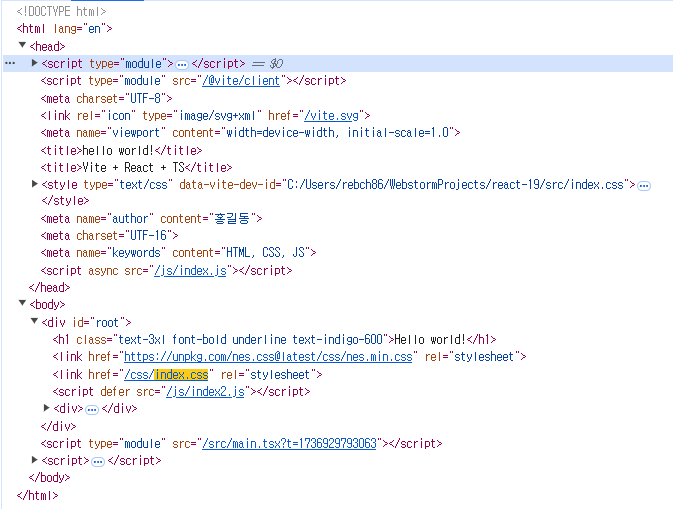
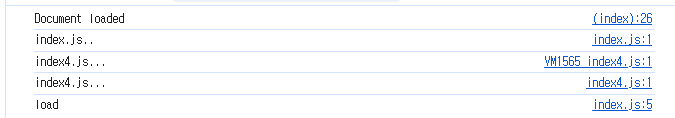
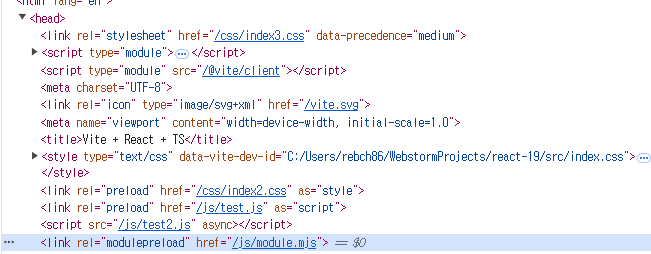

# React 19 API Examples

### 1. `/src/components/DocumentMetadataAndStyleSheetsAndAsyncScriptsExample.tsx`
- 메타데이터 태그가 자동으로 <head> 태그내로 이동.
- meta, title 태그가 html 문서 <head> 태그로 위치하도록, 자동으로 호이스팅 처리 된다.



호이스팅이 처리되면서 중복되는 태그들은 자동으로 중복처리를 해줄것으로 기대했으나, 중복에 대한 처리가 되지 않은것이 확인이 되었다. <link> 태그는 호이스팅이 이루어지지는 않았으나 CSS를 로딩해오고 평가되어 적용되는 부분은 확인 하였다.

- React 19 에서는 async script 를 직접 위치시켜 돟적으로 스크립트를 불러와 실행하는 기능이 추가 되었다.
- 중복으로 정의해도, 한번만 생성되어 삽입이 이루어진다.
- 이렇게 불러온, 스크립트에서 DOMContentLoaded 이벤트는 동작을 하지 않는다. 이미 리액트에서 실제 DOM 렌더링 직후에 스크립트를 동적으로 불러와서 발생하는 문제로 파악이 된다.(index.html 에 추가되어있는 DOMContentLoaded 이벤트는 정상동작 한다.)



```js
// public/js/index.js
console.log('index.js..');
alert("Hello World!");

window.addEventListener('load', () => {
    console.log('load');
});


// 추측: 이미 DOM이 로드된 상태이기 때문에, 이 이벤트가 실행이 안되는 것 같다.
document.addEventListener('DOMContentLoaded', () => {
    console.log('DOMContentLoaded'); // 어째서인지, 콘솔에 출력이 되지 않는다.
});

const indexHi = '카카로트 하이!';
```

script defer 로 불러오는 스크립트는 동작하지 않는다. 개발자 도구 네트워크탭에서 확인해보면 아예 로딩조차 되어있지 않는다. 그러나 DOM을 확인해보면 해당 스크립트가 삽입되어있는것은 확인이 가능하다.(useEffect 로 작성한 동적 스크립트 로딩에서는 정상 동작 확인을 하였다.)
defer 는 HTML 파싱과정에서 만나야하는데 동적으로 이를 추가(JSX 형태로)하면 이미 파싱과정을 지났기 때문에 동작하지않는것으로 이해를 하였다.   
결론적으로는 defer 속성이 있거나 아무 속성이 없는 스크립트 태그에 경우에는 JSX에 추가하면 추가가될뿐 로딩 및 실행이 되지 않는다.

onLoad prop 이 정상적으로 동작하지 않는 부분도 확인을 하였다. 문서에는 분명 설명이 되어있으나 동일한 이슈로 고생하는분들이 여럿있음을 확인하였다. 해결방법은 ref 를 사용하여 onload 를 직접 삽입해주면 된다.(onLoad prop 을 설정하면, 스크립트 로딩 자체가 안되는것도 확인을 하였다.)   
참조: https://velog.io/@skiende74/React-dom-19-%EB%B0%94%EB%80%90-script%EB%A5%BC-%EC%9D%B4%EC%9A%A9%ED%95%B4-%EC%84%A0%EC%96%B8%EC%A0%81%EC%9C%BC%EB%A1%9C-%EC%99%B8%EB%B6%80%EC%8A%A4%ED%81%AC%EB%A6%BD%ED%8A%B8-dedupe-load%ED%95%98%EA%B8%B0

```
useEffect(() => {
    let script = document.querySelector(
      `script[src="https://unpkg.com/lodash"]`
    );

    if (!script) {
      script = document.createElement("script");
      script.src = "https://unpkg.com/lodash";
      script.async = true;
      document.body.appendChild(script);
    }

    const handleLoad = () => setLoading(false);

    script.addEventListener("load", handleLoad);

    return () => {
      script.removeEventListener("load", handleLoad);
    };
  }, []);
```

그래도 위와같이 스크립트를 동적으로 불러오는 코드를 직접 짜는것보다 간결하게 사용이 가능해서 좋다.   
async 속성은 스크립트를 비동기로 로딩하고, 로딩이 완료되면 바로 실행을한다. defer 도 비동기로 로딩을 진행하나 HTML 파싱이 완료된 후 실행한다. 결론적으로는 실행시점이 다르다. async 는 만약 로딩이 빨리 끝난 스크립트가 있으면 순서에 상관없이 해당 스크립트부터 실행을 한다. defer 는 HTML 파싱이 완료된 후 실행을 하지만 HTML 문서에 나타난 순서대로 실행을 해준다.  

### 2. `/src/components/PreloadingResourcesExample.tsx`
- `react-dom` 패키지에서 제공해주는 `preload`, `preinit`, `preloadModule`, `preinitModule` 를 사용하여 리소스를 사전 로딩할 수 있다.
- 컴포넌트는 state 에 따라 조건부 렌더링을 해줘도 사전에 불러와진 리소스를 중복하여 요청하지는 않는다.
- 리소스 사전 로딩은 렌더링 시점과 이벤트 핸들러에서 동작이 이루어진다.
- css 같은건 import 하고, React.lazy() 사용해서 코드분할 하면 되지 않는가? 라는 생각도 들었는데 일단 애초에 컨셉이 다르다. 코드 분할은 말그대로 번들 사이즈 감소(번들 사이즈 감소를 통한 성능 개선)가 목적이고 사전 로딩은 사용자 경험 최적화가 목적이다.
- precedence 옵션을 통해 스타일시트에 우선순위를 제어할 수 있다.



preload 및 preinit 으로 호출되는 리소스들이 head 태그에 삽입되어있는 것이 확인이 가능하다.   
이렇게 리액트에서 직접 개발자가 사전에 로딩이 되어야할 리소스를 쉽게 제어가 가능하다. 그러나, 모든 리소스를 사전에 로딩하면 페이지 렌더링이 오히려 느려질 위험이 있다.

### 3. `/src/components/RefExample.tsx`
- React 19에서 하위(자식) 컴포넌트에 ref prop 을 그대로 사용이 가능해졌다.
- ref prop 은 RefObject 또는 RefCallback 타입이 될 수 있으므로 Ref<T> 타입으로 지정해준다.
- forwardRef 를 사용하지 않음으로써 코드가 간단해지는 이점을 얻을 수 있다.
- 이전에는 forwardRef 사용을 피하기 위해서는 childRef 와 같은 이름으로 명명해야했는데 이제는 ref prop 명을 그대로 사용함으로써 동일한 인터페이스를 유지가 가능하고 ref prop 이름을 명명하는데 고민을 하지 않아도 된다.

```jsx 
// before React 19

function App() {
    const buttonRef = useRef();

    const onButtonClick = () => console.log(buttonRef.current);

    return (
        <button ref={buttonRef} onClick={onButtonClick}>
            클릭
        </button>
    );
}

const Button = forwardRef((props, ref) => {
    return <button ref={ref} {...props} />;
});
```

```jsx
// before React 19

import React, { useRef } from 'react';

function App() {
    const buttonRef = useRef();

    const onButtonClick = () => {
        console.log(buttonRef.current);  // buttonRef를 직접 사용
    };

    return (
        <Button onClick={onButtonClick} buttonRef={buttonRef} />
    );
}

function Button({ onClick, buttonRef }) {
    return (
        <button ref={buttonRef} onClick={onClick}>
            클릭
        </button>
    );
}

export default App;
```

### 4. `/src/components/UseActionState.tsx`
- React 19에 추가된 훅으로 폼 액션을 기반으로 상태를 관리하는 훅이다.
```js
const [state, formAction, isPending] = useActionState(fn, initialState, permalink?);
```
- useState() 와 유사한데, 상태 업데이트를 formAction 함수에서 반환한 값으로 한다고 생각하면 된다.
- fn 인자에 액션 함수를 전달한다.
- form 태그에 action prop 또는 button 태그에 formAction prop 에 formAction 을 바인딩해주면 된다. 이렇게 사용하면 formData 를 넘겨주므로 form 상태를 비제어로 관리가 가능해진다.
- 작성한 코드에서는 Add to Cart 를 누르고 하나가 로딩 상태가 걸리면 다른 하나도 로딩상태가 걸린다. 이것은 CSR 환경이라서 그런거라 생각한다. 서버 환경이라면 각 요청이 개별로 처리되므로 하나가 로딩이 걸리면 다른 작업도 로딩이 걸리지는 않을거다.
- isPending 을 통하여, formAction 처리 상태를 다룰 수 있다.
- useActionState() 훅을 활용하여 form 에 대한 상태관리, 비동기 작업, 로딩 상태를 체크할 수 있다. 이를 통해 개발 경험 향상과 액션 결과에 따른 새로고침 없는 상태 업데이트는 사용자 경험을 향상 시킨다. 다만, formData 를 전달받는 형태로 사용하면 유효성 검사가 액션 함수로 위임이 되는데 이런 경우에느 유효성 검사를 하는 반복적인 코드가 발생할 확률이 높다. 이를 어떻게 추상화하고 모듈화 시킬지를 또 고민을 해야 할 것이다.

### 5. `src/components/UseAPIExample.tsx` / `src/components/UseContextExample.tsx`
- React 19에 추가된 훅으로 context 를 읽거나, Promise 를 처리한다.
```ts
export type Usable<T> = PromiseLike<T> | Context<T>;

export function use<T>(usable: Usable<T>): T;
```
- use() 훅은 인자로 Usable 타입을 받는다. Usable 타입을 보면 PromiseLike 라고 되어있는것을 보니 thenable 객체(then 메서드를 가진 객체)도 처리가 가능할 것으로 생각이 된다.(Promise 는 항상 thenable 이다. 하지만, thenable 이 항상 Promise 인 것은 아니다.)
```js
// thenable 객체의 예시
const thenable = {
  then: function(resolve, reject) {
    resolve('데이터');
  }
};

// Promise는 thenable을 자동으로 처리할 수 있습니다
Promise.resolve(thenable).then(data => {
  console.log(data); // '데이터' 출력
});
```
- use 훅을 사용하여, Context 를 구독하는것은 매우 간단하다. useContext() 훅 대신에 use() 훅을 사용하면 끝이다.
- use 훅을 사용한, Promise 처리(비동기 data fetch)같은 경우에는 `Suspense` 와 `ErrorBoundary` 를 같이 사용해줘야한다. use 훅에서 Promise 가 resolve 될때까지 렌더링을 중단한다. 그래서 이러한 던져진 Promise 상태를 처리할 Suspense 가 필요한거다.
- use 훅을 사용하여, Promise 를 처리할 때 에러가 나는 경우도 있을거다. 이건 어떻게 처리해야하나하다가 이부분은 ErrorBoundary 로 해결이 가능하다.
- use 훅을 사용하면, 하나의 API로 Context 와 Promise 처리가 모두 가능하다. 그리고 Promise 처리로 인해 동시성 렌더링을 쉽게 구현이 가능하다.
- use 훅을 사용하여, 읽을 수 있는 데이터가 많아지면 복잡도가 증가하는것은 아닌가? 생각을 했다. 그런데 use 훅 입장에서는 일관된 데이터를 읽는다는 패턴을 제공하는 점에서 오히려 추상화가 잘 되었구나 생각을 하였다. 그리고 use 훅을 통해 읽고싶은 데이터를 조건부로도 실행이 가능하니 이후에도 다양한 데이터 읽기를 use 훅이 지원을 하겠구나라는 생각도 들었다.

---

# React + TypeScript + Vite

This template provides a minimal setup to get React working in Vite with HMR and some ESLint rules.

Currently, two official plugins are available:

- [@vitejs/plugin-react](https://github.com/vitejs/vite-plugin-react/blob/main/packages/plugin-react/README.md) uses [Babel](https://babeljs.io/) for Fast Refresh
- [@vitejs/plugin-react-swc](https://github.com/vitejs/vite-plugin-react-swc) uses [SWC](https://swc.rs/) for Fast Refresh

## Expanding the ESLint configuration

If you are developing a production application, we recommend updating the configuration to enable type aware lint rules:

- Configure the top-level `parserOptions` property like this:

```js
export default tseslint.config({
  languageOptions: {
    // other options...
    parserOptions: {
      project: ['./tsconfig.node.json', './tsconfig.app.json'],
      tsconfigRootDir: import.meta.dirname,
    },
  },
})
```

- Replace `tseslint.configs.recommended` to `tseslint.configs.recommendedTypeChecked` or `tseslint.configs.strictTypeChecked`
- Optionally add `...tseslint.configs.stylisticTypeChecked`
- Install [eslint-plugin-react](https://github.com/jsx-eslint/eslint-plugin-react) and update the config:

```js
// eslint.config.js
import react from 'eslint-plugin-react'

export default tseslint.config({
  // Set the react version
  settings: { react: { version: '18.3' } },
  plugins: {
    // Add the react plugin
    react,
  },
  rules: {
    // other rules...
    // Enable its recommended rules
    ...react.configs.recommended.rules,
    ...react.configs['jsx-runtime'].rules,
  },
})
```
